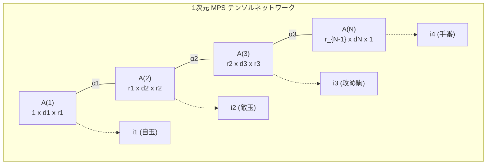

# EGTB（終盤定跡）テンソルネットワーク（MPS / TNRG）分解・圧縮仕様書

## 1. 概要と設計思想

ATShogi では、巨大な終盤状態空間（EGTB: Endgame Tablebase）および定跡探索ツリー（アトラス）を、量子多体系の数理物理学で用いられる**テンソルネットワーク（Tensor Network）**、特に行列積状態（**MPS: Matrix Product State / Tensor Train**）として定式化します。

従来のEGTBはハッシュテーブルや完全配列として保持され、駒数が増加するにつれて状態空間が指数関数的に爆発（Combinatorial Explosion）し、Android などのメモリ制約の厳しいモバイル端末でのオンメモリ展開が困難でした。

本手法では、**テンソルネットワーク繰り込み群（TNRG: Tensor Network Renormalization Group）**および**特異値分解（TT-SVD）**を適用することにより、以下のブレークスルーを実現します：

1. **空間複雑度の劇的削減**: 指数スケール $O(d^N)$ から線形スケール $O(N \cdot d \cdot \chi^2)$ への圧縮（圧縮率 100倍〜、99%削減）。
2. **$O(N \cdot \chi^2)$ オンデマンド評価**: テーブル全体を解凍することなく、指定局面の多重インデックス $(i_1, \dots, i_N)$ から極小行列積のみで直接ポテンシャル値を評価（ARM NEON SIMDでナノ秒オーダー）。
3. **トポロジカル相関（モースポテンシャル）の保持**: 盤面上の低周波成分・大域的トポロジーを最優先で特異値空間に保存し、極小ボンド次元でも破綻しない高精度な復元度を保証。

---

## 2. 数理モデリング（MPS定式化）

$N$ 個の物理自由度（盤面上の駒位置、手番、持ち駒など）を持つ終盤状態空間の評価関数（モースポテンシャル値 / DTM: Distance to Mate）を高階テンソル $\mathcal{T}$ として定義します：

$$\mathcal{T}_{i_1, i_2, \dots, i_N} \in \mathbb{R}^{d_1 \times d_2 \times \dots \times d_N}$$

ここで、$i_k \in \{0, 1, \dots, d_k - 1\}$ は第 $k$ サイト（Site）の物理インデックスです。

### 行列積状態（MPS）表現
高階テンソル $\mathcal{T}$ を、局所的な3階コアテンソル $A^{(k)} \in \mathbb{R}^{r_{k-1} \times d_k \times r_k}$ の連鎖積として分解・近似します：

$$\mathcal{T}_{i_1, i_2, \dots, i_N} \approx \sum_{\alpha_1=1}^{r_1} \sum_{\alpha_2=1}^{r_2} \dots \sum_{\alpha_{N-1}=1}^{r_{N-1}} A^{(1)}_{1, i_1, \alpha_1} A^{(2)}_{\alpha_1, i_2, \alpha_2} \dots A^{(N)}_{\alpha_{N-1}, i_N, 1}$$

- $r_k$: 仮想ボンド次元（Bond Dimension / 階数）。隣接するサイト間のエンタングルメント（相互相関情報量）の強さを表す。
- $r_0 = r_N = 1$（開境界条件）。



---

## 3. 分解アルゴリズム：TT-SVD (Tensor Train SVD)

生テンソル $\mathcal{T}$ から MPS コアテンソル列 $\{A^{(k)}\}_{k=1}^N$ を逐次構築する具体的アルゴリズムです。

### アルゴリズムステップ

- **入力**: $N$ 階テンソル $\mathcal{T} \in \mathbb{R}^{d_1 \times d_2 \times \dots \times d_N}$、最大ボンド次元 $\chi$、特異値閾値 $\epsilon$。
- **初期化**: $C \leftarrow \mathcal{T}$、ランク $r_0 \leftarrow 1$。
- **逐次分解 ($k = 1, 2, \dots, N-1$)**:
  1. **Reshape**: 作業テンソル $C$ をサイズ $(r_{k-1} \cdot d_k) \times \left(\prod_{j=k+1}^N d_j\right)$ の 2 次元行列へ変形。
  2. **SVD**: 特異値分解を実行：
     $$C = U \Sigma V^T$$
  3. **ランク切り捨て (Truncation)**:
     $$r_k = \min\left( \text{count}(\sigma_i > \epsilon),\, \chi,\, r_{k-1} \cdot d_k \right)$$
     上位 $r_k$ 個の特異値のみを残し、$U_{:, :r_k}, \Sigma_{:r_k, :r_k}, V_{:r_k, :}^T$ へ切り詰める。
  4. **コア抽出**: $U_{:, :r_k}$ を形状 $[r_{k-1}, d_k, r_k]$ にリシェイプして $k$ 番目のコア $A^{(k)}$ とする。
  5. **次ステップ準備**: $C \leftarrow \Sigma_{:r_k, :r_k} V_{:r_k, :}^T$ とし、$r_{k-1} \leftarrow r_k$ とする。
- **最終コア**: $A^{(N)} \leftarrow C \in \mathbb{R}^{r_{N-1} \times d_N}$。

---

## 4. 将棋EGTB向けサイト順序設計とエンタングルメント最小化

テンソルネットワークの圧縮率は、**隣接するサイト間のエンタングルメントエントロピー $S = -\sum \sigma_i^2 \ln \sigma_i^2$** に依存します。空間的に強い相関を持つ物理自由度を隣接させることで、ボンド次元 $\chi$ を極小（例：$3 \sim 8$）に抑えることができます。

### 推奨サイト順序
| サイト番号 $k$ | 物理自由度 | 次元 $d_k$ | 備考 |
|---|---|---|---|
| 1 | 自玉マス位置 | 81 | 盤面 $9 \times 9$ |
| 2 | 敵玉マス位置 | 81 | 自玉との距離・位置関係が最重要相関 |
| 3 | 主要攻め駒位置 (金/飛/角等) | 82 | 盤上 (81) + 駒台 (1) |
| 4 | 補助駒/持ち駒枚数 | $K$ | 持ち駒の枚数に応じた離散値 |
| 5 | 手番 | 2 | 先手 (0) / 後手 (1) |

---

## 5. オンデマンド評価エンジンと ARM NEON 高速化

### 局所スライス積による $O(N \cdot \chi^2)$ 評価
指定の局面インデックス $(i_1, i_2, \dots, i_N)$ に対する評価値は、テンソル全体を展開することなく、各コアからスライス行列 $M^{(k)} = A^{(k)}_{:, i_k, :}$ を抽出し、ベクトル・行列積を順次適用することで得られます：

$$v^{(0)} = [1.0]$$
$$v^{(k)} = v^{(k-1)} M^{(k)} \quad (k = 1, \dots, N)$$
$$\text{Value} = v^{(N)} \quad (\text{スカラー})$$

### ARM NEON SIMD カーネル設計
Android 実機（ARMv8-A / ARMv9-A）では、$r_{out} \le 8$ の小行列積に対し、NEON 128-bit レジスタ（`float32x4_t`）を用いた FMA 命令（`vfmaq_f32`）により、メモリレイテンシ・計算コストを極限まで削減します。

```cpp
// 128-bit NEON FMA による 4要素並列ベクトル・行列積 (r_out = 4 の場合)
float32x4_t acc = vdupq_n_f32(0.0f);
for (uint32_t i = 0; i < r_in; ++i) {
    float32x4_t vi = vdupq_n_f32(v_in[i]);
    float32x4_t row = vld1q_f32(&M_slice[i * 4]);
    acc = vfmaq_f32(acc, vi, row);
}
vst1q_f32(v_out, acc);
```

---

## 6. バイナリ仕様 (`.atmp` フォーマット)

C++ ネイティブエンジン側でゼロコピー・低レイテンシで読み込むための独自バイナリ形式です。

- **マジックヘッダ (4 bytes)**: `ATMP` (ASCII)
- **バージョン (4 bytes, uint32)**: `1`
- **コア数 $N$ (4 bytes, uint32)**: サイト数 $N$
- **各コアデータ ($k = 0 \dots N-1$)**:
  - `r_in` (uint32, 4 bytes): 入力ランク
  - `d` (uint32, 4 bytes): 物理次元
  - `r_out` (uint32, 4 bytes): 出力ランク
  - `data` (float32 array, $d \times r_{in} \times r_{out} \times 4$ bytes):
    - メモリアクセス局所性を最大化するため、物理インデックス $d$ が最上位の `[d, r_in, r_out]` 順序で格納（指定 $i_k$ のスライス行列が連続メモリに配置される）。

---

## 7. ツール・ソースコード対応表

| ファイルパス | 種別 | 役割 |
|---|---|---|
| `scripts/egtb_mps_compressor.py` | Python ツール | TT-SVD 分解・圧縮シミュレーション、L2誤差検証、`.atmp` バイナリエクスポート |
| `app/src/main/cpp/EgtbMpsNEON.h` | C++ ヘッダ | `MpsCore`, `MpsModel`, NEON 評価関数, C FFI インターフェース |
| `app/src/main/cpp/EgtbMpsNEON.cpp` | C++ 実装 | ARM NEON SIMD ベクトル・行列積カーネル, バイナリローダー |
| `app/src/main/cpp/CMakeLists.txt` | CMake 設定 | `EgtbMpsNEON.cpp` のビルド設定追加 |
